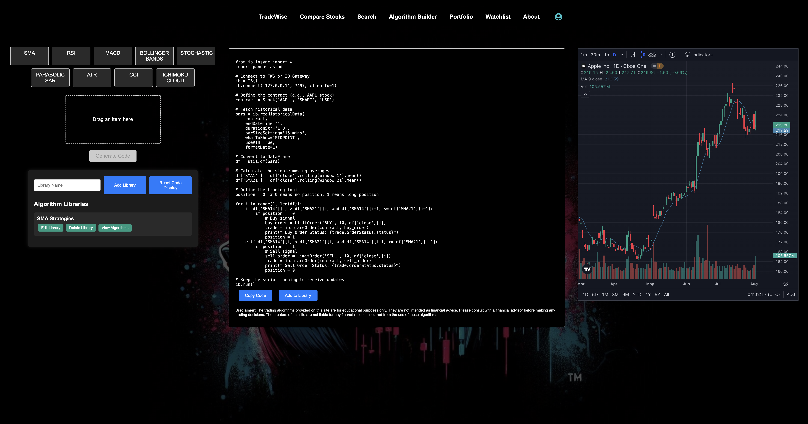

# TradeWise_AlgoBuilder

Welcome to TradeWise_AlgoBuilder.

TradeWise is an innovative financial technology platform designed to empower users with comprehensive tools for stock research, portfolio management, investment analysis, and algorithm building. The website offers a wide range of features that cater to both novice investors and seasoned traders, providing them with the necessary resources to make informed financial decisions.

## Live Link
You can access the live version of TradeWise_AlgoBuilder [https://tradewise-algobuilder.onrender.com](#).

## Key Features and User Capabilities

### Stock Research
- **Detailed Stock Information**: Users can access in-depth details about various stocks.
- **Historical Data**: The platform provides historical price data, allowing users to analyze the performance of stocks over time and calculate percentage gains or losses.
- **Real-Time Data**: Integration with the TradingView widget ensures that users receive up-to-date information and real-time stock charts for precise market analysis.

### Portfolio Management
- **Create and Manage Portfolios**: Users can create multiple portfolios to organize and manage their investments efficiently. Each portfolio can track the performance of individual stocks and overall portfolio value.
- **Add and Update Stocks**: The platform allows users to add stocks to their portfolios with details like quantity and purchase price. Users can also update stock information to reflect changes in their investment strategy.
- **Performance Metrics**: TradeWise calculates key performance metrics such as current portfolio value, purchase value, profit/loss, and percentage gain/loss, providing users with a clear view of their investment performance.

### Watchlist Management
- **Create and Manage Watchlists**: Users can create and manage watchlists to monitor stocks they are interested in. This feature helps users keep an eye on potential investment opportunities.
- **Add Stocks to Watchlists**: Users can easily add stocks to their watchlists, enabling quick access to real-time data and performance analysis for those stocks.

### Algorithm Builder
- **Drag-and-Drop Interface**: Users can drag and drop indicator blocks to visually build trading algorithms.
- **Custom Input Modal**: After dropping an indicator, users input specific parameters to customize their algorithm.
- **Generate and Save Code**: The platform generates custom algorithm code based on user inputs, which can be saved to the library for future use.




Here's a sample function demonstrating how we handle the drag-and-drop interaction to trigger custom code generation for the user:

```jsx
const handleDrop = (type) => {
  setIndicatorType(type);
  setDroppedItem(type);
  setSymbol('');
  setModalContent(
    <CustomInputModal
      show={true}
      onClose={() => {
        closeModal();
        setDroppedItem(null);
      }}
      indicatorType={type}
      onSubmit={(data) => {
        setFormData(data);
        setSymbol(data.symbol);
        setStudies([type]);
        closeModal();
      }}
    />
  );
};
```

This function sets the state with the selected indicator type, opens a modal for user input, and upon submission, updates the state with the provided data, ready for generating the custom algorithm code. This process ensures a seamless and interactive experience for users to build and customize their trading algorithms visually and efficiently.

### User-Friendly Interface
- **Intuitive Design**: TradeWise boasts a user-friendly interface with a clean and organized layout, making it easy for users to navigate and access the features they need.

TradeWise is designed to be a one-stop solution for investors looking to enhance their stock research, portfolio management, and algorithm building capabilities. By offering detailed stock information, real-time data, comprehensive portfolio tracking, a user-friendly interface, and a powerful algorithm builder, TradeWise empowers users to make informed investment decisions and achieve their financial goals.


## Technologies Used
- **Frontend**: React, Redux, react-beautiful-dnd
- **Backend**: Flask, SQLAlchemy
- **Database**: PostgreSQL
- **Other**: Docker, TradingView Widget, Finnhub API

## Getting started

1. Clone this repository (only this branch).

2. Install dependencies.

   ```bash
   pipenv install -r requirements.txt
   ```

3. Create a __.env__ file based on the example with proper settings for your
   development environment.

4. Make sure the SQLite3 database connection URL is in the __.env__ file.

5. This starter organizes all tables inside the `flask_schema` schema, defined
   by the `SCHEMA` environment variable.  Replace the value for
   `SCHEMA` with a unique name, **making sure you use the snake_case
   convention.**

6. Get into your pipenv, migrate your database, seed your database, and run your
   Flask app:

   ```bash
   pipenv shell
   ```

   ```bash
   flask db upgrade
   ```

   ```bash
   flask seed all
   ```

   ```bash
   flask run
   ```

7. To run the React frontend in development, `cd` into the __react-vite__
   directory and run `npm i` to install dependencies. Next, run `npm run build`
   to create the `dist` folder. The starter has modified the `npm run build`
   command to include the `--watch` flag. This flag will rebuild the __dist__
   folder whenever you change your code, keeping the production version up to
   date.
